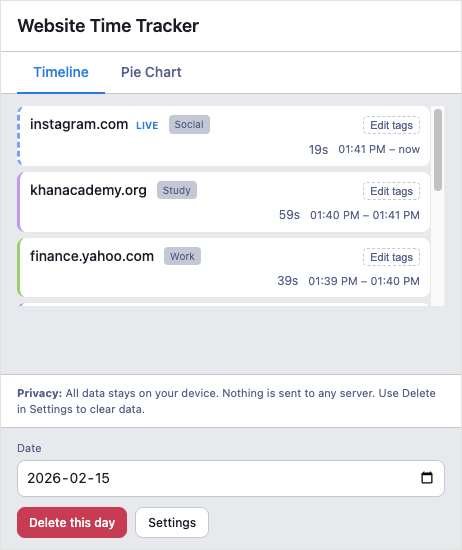
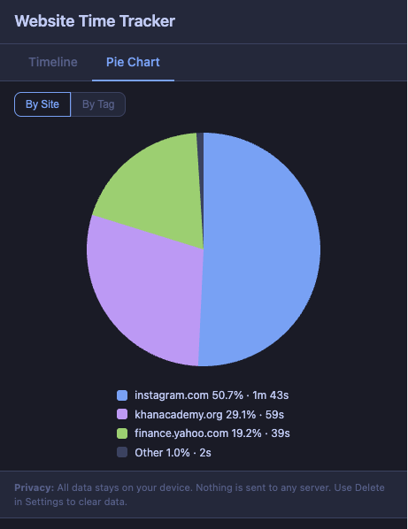
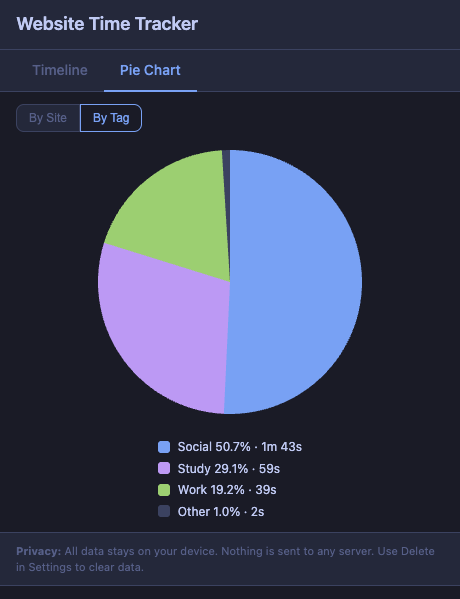
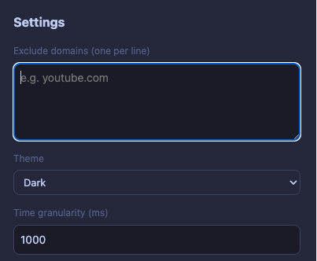
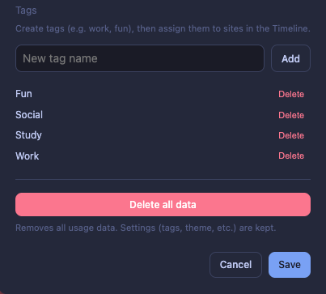

# Website Time Tracker

**Website Time Tracker** is a Chrome Extension (Manifest V3) that helps you understand how you spend your time online. See exactly where your attention goes and make smarter decisions about your browsing habits.

Track time spent on each website, automatically categorize sites by tags (social, study, work, etc.), and view a clear daily breakdown with an interactive timeline and pie chart. 

All data stays on your device — no accounts, no cloud syncing, no external servers. Simple, private, and built to help you stay focused.

## Features

- **Daily timeline** — Chronological breakdown of domain + duration
- **Pie chart** — Percentage breakdown per domain or by tag
- **Tags** — Create tags in Settings and assign them to sites in the timeline; view time by tag in the pie chart
- **Privacy-first** — No backend; all data in `chrome.storage.local`
- **Delete all data** — One-click clear
- **Domain exclusion** — Exclude domains from tracking

## Screenshots

### Timeline
  
Daily timeline: domains with tags (e.g. Social, Study, Work), duration and time range per visit, “Edit tags”, date picker, and Delete this day / Settings. A “live” badge shows current activity.

### Pie chart — by site
  
Pie chart with “By Site” selected: time broken down by domain with percentages and durations.

### Pie chart — by tag
  
Same view with “By Tag” selected: time aggregated by tag with percentages and durations.

### Settings
  
**Settings (top):** Exclude domains, Theme (Dark/Light), Time granularity.

  
**Settings (bottom):** Create/add tags, Delete all data.

## Installation (unpacked)

1. Clone or download this folder.
2. Open Chrome → **Extensions** → **Manage extensions** → **Developer mode** (on).
3. Click **Load unpacked** and select this folder (the one containing `manifest.json`).
4. (Optional) Right-click the extension → **Manage extension** → enable **Allow in Incognito**.

## Permissions

- **tabs** — Detect active tab and hostname
- **storage** — Store usage data locally
- **alarms** — Periodic persistence
- **idle** — Pause tracking when you’re idle

## Privacy

See [PRIVACY.md](PRIVACY.md). All data stays on your device; nothing is sent anywhere.

## Testing

- **Unit tests:** `node tests/unit.js` — tests date key, hostname extraction, time rounding, timeline aggregation.

## Version

1.0.0
